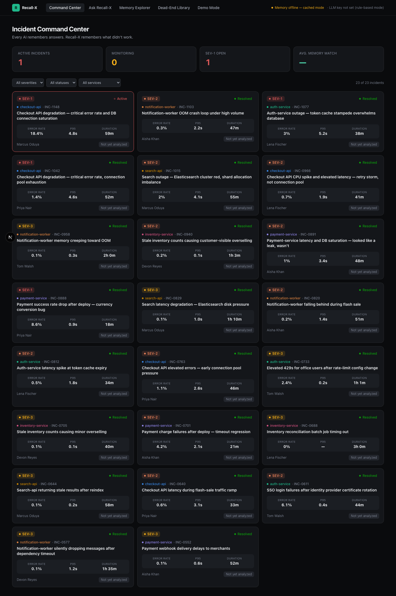
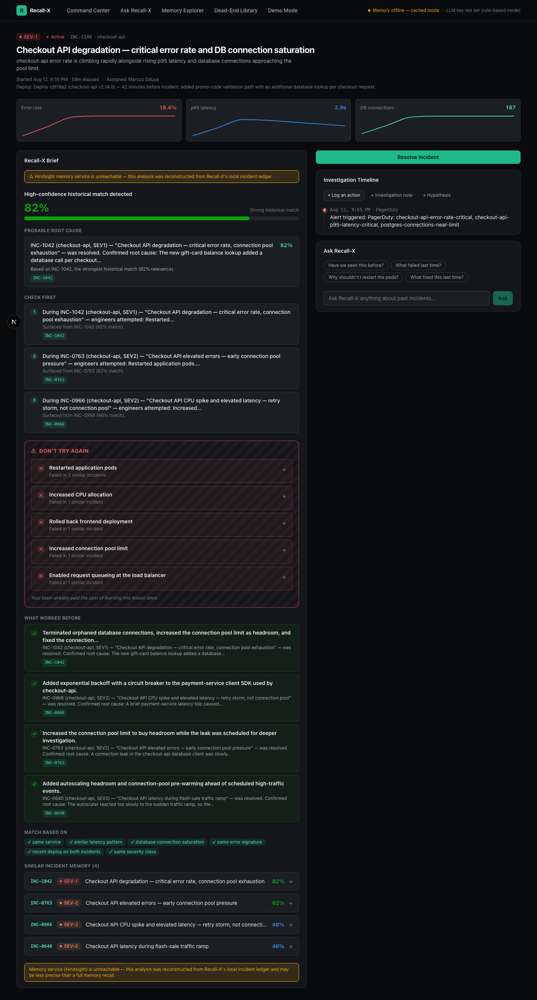
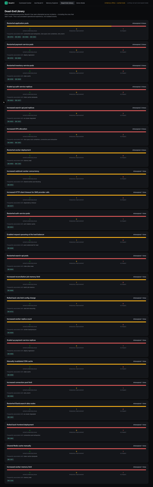

# Recall-X

> **Every AI remembers answers. Recall-X remembers what didn't work.**

Recall-X is an AI-powered on-call incident copilot with **persistent operational memory**, built on [Hindsight](https://github.com/vectorize-io/hindsight). It is not a chatbot bolted onto an incident tracker — it's an incident command center whose AI has actually read your organization's history of what engineers tried during past incidents, what failed, what partially helped, and what finally worked.



## The problem

On-call engineers repeatedly waste time during production incidents re-trying troubleshooting steps that already failed during similar incidents weeks or months earlier. Traditional incident-management tools preserve the final resolution — but the valuable knowledge about *what was attempted and didn't work* usually disappears the moment the postmortem doc is archived.

## The solution

Recall-X treats **Attempt + Context + Outcome** as the core unit of memory — not just "here's what fixed it," but a structured record of every troubleshooting step, whether it solved the problem, partially helped, or was a dead end. When a new incident comes in, Recall-X recalls relevant history and gives the on-call engineer three things immediately:

1. **Probable Root Cause** — with confidence and historical evidence
2. **Check First** — specific, evidence-grounded investigation steps (never "check the logs")
3. **Don't Try Again** — the differentiator: things already tried that didn't work, with proof

> *"Before I spend 30 minutes trying this, Recall-X can tell me that three engineers already tried it during similar incidents — and exactly what happened."*

## Why Hindsight

Recall-X's intelligence is not decorative memory — it depends on [Hindsight](https://hindsight.vectorize.io) end to end:

- **`retain()`** is called for every troubleshooting attempt and every resolution, tagged with service, incident ID, severity, recurring-pattern label, and outcome (`kind:attempt-failed`, `kind:attempt-success`, `kind:resolution`, …).
- **`recall()`** powers the Recall-X Brief: a service-scoped recall plus an unscoped cross-service recall are merged and reranked, and Hindsight's own `scores.final` becomes the "Memory Match %" shown in the UI.
- **`reflect()`** with a JSON `response_schema` powers **Ask Recall-X**, so the remembered-vs-inference distinction in every answer comes from Hindsight's own agentic reflection over the memory bank, not a bolted-on wrapper.
- **Bank stats** (`getAgentStats`) are surfaced live in the Memory Explorer's "Memory Graph" panel.

Without persistent historical memory, Recall-X has no way to know what the organization already tried — that's the entire premise of the product, so the Hindsight integration in `lib/hindsight/`, `lib/memory/`, `lib/brief/`, and `lib/ask/` is the core of the codebase, not a side feature.

**Recall-X also stays honest about its evidence.** Every Brief distinguishes **remembered evidence** (direct citations to real incident IDs) from **AI inference** (Claude's reasoning about what that evidence implies), never presents speculation as certainty, and explicitly calls out when historical incidents look similar but had different root causes (see `INC-0891` and `INC-0966` in the seed data — both superficially resemble the hero incident but are red herrings).

## Key features

- **Incident Command Center** — live incident cards with severity, service, duration, key metrics, and a memory-match indicator.
- **Investigation Workspace** — the hero screen: Recall-X Brief (probable cause, check-first, **Don't Try Again** with a distinctive hazard treatment, what-worked-before), live metrics, similar-incident memory with full historical detail, and an embedded Ask Recall-X panel.
- **Investigation Timeline** — log actions/notes/hypotheses as they happen; every action can be outcome-tagged (`✓ Solved it / △ Partially helped / ✕ Didn't help / ? Inconclusive`) — that's the "Teach Recall-X" moment, written to memory immediately.
- **Resolve → Memory Updated** — resolving an incident shows exactly what Recall-X just learned (root cause, investigation signals, dead ends, verified fix) and persists it.
- **Memory Explorer** — organization-wide stats: incidents remembered, dead ends learned, verified fixes, recurring root-cause patterns, services with memory, and live Hindsight memory-graph stats.
- **Dead-End Library** — every troubleshooting action ever attempted, aggregated across incidents and services, with solved/partial/no-impact breakdowns — proof Recall-X accumulates operational experience, not isolated events.
- **Ask Recall-X** — conversational investigation, global or scoped to an incident/service, with **Remembered** vs **Inference** clearly separated in every answer.
- **Demo Mode** — a guided, non-scripted walkthrough proving memory compounds: Stage 1 (2 historical incidents known → low confidence) → Stage 2 (full history → pattern recognized) → Stage 3 (full recall on the hero incident) → Stage 4 (resolve it live, then ask Recall-X and get the answer back from memory just written).
- **Graceful degradation everywhere** — if Hindsight or the LLM is unreachable, every surface falls back to a clearly-labeled deterministic mode instead of breaking. See [Fallback behavior](#fallback-behavior).

## Demo scenario

The seed data includes ~22 historical incidents across 6 services (`checkout-api`, `payment-service`, `auth-service`, `notification-worker`, `inventory-service`, `search-api`) with recurring failure patterns, red-herring lookalikes, and one polished **hero incident**:

> **INC-1148 — Checkout API degradation.** Error rate 0.7% → 18.4%, p95 latency 4.8s, DB connections at 187/200, 42 minutes after a deploy that added a new DB lookup to the checkout path.

Recall-X recognizes this as the same failure class as `INC-1042` and `INC-0763` (a real connection leak) while correctly flagging that `INC-0891` (payment-service, similar symptoms, different root cause — a slow query) and `INC-0966` (checkout-api, similar symptoms, actually a retry storm) are *not* proof of the same diagnosis.





## Setup

### Prerequisites

- Node.js 20+
- (Optional but recommended) Docker, to run Hindsight locally
- (Optional but recommended) an Anthropic API key, for narrated Briefs and Ask Recall-X

### 1. Install dependencies

```bash
npm install
```

### 2. Configure environment

```bash
cp .env.example .env
```

See [Environment variables](#environment-variables) below.

### 3. Run Hindsight (recommended)

```bash
docker run -it --pull always --name hindsight --restart unless-stopped \
  -p 8888:8888 -p 9999:9999 \
  -e HINDSIGHT_API_LLM_API_KEY=$ANTHROPIC_API_KEY \
  -e HINDSIGHT_API_LLM_PROVIDER=anthropic \
  -v hindsight-data:/home/hindsight/.pg0 \
  ghcr.io/vectorize-io/hindsight:latest
```

Hindsight's API is now at `http://localhost:8888` (matches the default `HINDSIGHT_API_URL`) and its own UI at `http://localhost:9999`, where you can inspect the raw memory bank Recall-X writes to.

**Don't have Docker handy?** Set `SKIP_HINDSIGHT=true` in `.env` and Recall-X runs entirely in its local-ledger fallback mode — every feature still works, see [Fallback behavior](#fallback-behavior).

### 4. Set up the local database and seed demo data

```bash
npm run db:migrate
npm run seed
```

The seed script populates SQLite with the full incident history described above **and** retains every attempt/resolution into Hindsight (skipped automatically if Hindsight isn't reachable, or if `SKIP_HINDSIGHT=true`). Re-run `npm run seed` any time to reset to a pristine demo state — it wipes and reseeds both stores.

### 5. Run it

```bash
npm run dev
```

Open `http://localhost:3000`.

## Environment variables

See `.env.example` for the full annotated list. Summary:

| Variable | Purpose | Default |
|---|---|---|
| `HINDSIGHT_API_URL` | Hindsight server URL | `http://localhost:8888` |
| `HINDSIGHT_API_KEY` | Bearer token, only needed for Hindsight deployments that enforce auth | _(unset)_ |
| `HINDSIGHT_BANK_ID` | Memory bank name, created automatically | `recallx` |
| `ANTHROPIC_API_KEY` | Powers Brief narration + Ask Recall-X fallback synthesis | _(unset → rule-based mode)_ |
| `ANTHROPIC_MODEL` | Model id | `claude-sonnet-5` |
| `DATABASE_URL` | libSQL connection URL — local embedded file for dev, hosted (e.g. Turso) for serverless deploys | `file:./data/recallx.db` |
| `DATABASE_AUTH_TOKEN` | Auth token for a hosted libSQL/Turso database | _(unset)_ |
| `SKIP_HINDSIGHT` | Force fallback mode even if Hindsight is reachable | `false` |

## Fallback behavior

Recall-X is designed to **never show a broken or blank screen**, per the product principle that this has to be demoable under real conditions:

- **Hindsight unreachable** → the Recall-X Brief and Similar Incidents reconstruct evidence from Recall-X's own local SQLite ledger (same-service, same-pattern matching instead of semantic recall), clearly labeled with a "memory service unavailable" banner. Ask Recall-X (which has no meaningful answer without live memory) says so plainly instead of guessing. Attempts/resolutions are still recorded locally and marked as pending sync.
- **Anthropic key unset or the API call fails** → Brief synthesis falls back to a deterministic, non-LLM template that is still fully grounded in the same retrieved evidence — every citation is real, just without narrative polish.
- Every mutation (logging an attempt, teaching an outcome, resolving) reports back whether it reached Hindsight, so the UI is always honest about what's actually persisted where.

You can force this mode at any time with `SKIP_HINDSIGHT=true` to demo graceful degradation deliberately.

## Deploying to Vercel

Vercel Functions have an ephemeral, per-invocation filesystem — a local SQLite file can't be used as the database there (different requests can hit different instances with no shared disk). Recall-X's data layer is libSQL, so the fix is to point it at a hosted libSQL database instead of a local file; no schema or code changes needed.

1. **Create a hosted libSQL database.** [Turso](https://turso.tech) has a free tier and is the easiest path:
   ```bash
   turso db create recallx
   turso db show recallx --url          # -> DATABASE_URL
   turso db tokens create recallx       # -> DATABASE_AUTH_TOKEN
   ```
2. **Run migrations and seed against it** from your machine before (or after) deploying:
   ```bash
   DATABASE_URL=libsql://your-db.turso.io DATABASE_AUTH_TOKEN=... npm run db:migrate
   DATABASE_URL=libsql://your-db.turso.io DATABASE_AUTH_TOKEN=... npm run seed
   ```
3. **Set environment variables in the Vercel project** (Settings → Environment Variables): `DATABASE_URL`, `DATABASE_AUTH_TOKEN`, `HINDSIGHT_API_URL` (a Hindsight instance reachable from Vercel — a local `localhost:8888` won't be, so use a deployed/hosted Hindsight endpoint or leave `SKIP_HINDSIGHT=true` to run in fallback mode), `HINDSIGHT_API_KEY` if applicable, `ANTHROPIC_API_KEY`, `ANTHROPIC_MODEL`.
4. **Deploy.** Vercel auto-detects Next.js; no build command changes needed.

If you don't want to stand up a hosted database or Hindsight instance for a quick deploy, set `SKIP_HINDSIGHT=true` and point `DATABASE_URL` at a Turso database anyway (still required — Vercel has no writable local disk) — the app runs fully in its local-ledger/rule-based fallback mode described above.

## Technology stack

- **Next.js 16** (App Router, React 19, TypeScript) — server components for data-heavy pages, client components for interactive workspace/chat surfaces
- **Tailwind CSS v4** — CSS-first theme, single dark design system
- **libSQL** (`@libsql/client` + Drizzle ORM) — the operational system of record (live incidents, timeline, attempts, resolutions). Runs as an embedded local SQLite file for development and against a hosted libSQL database (e.g. [Turso](https://turso.tech)) in serverless deployments
- **[`@vectorize-io/hindsight-client`](https://github.com/vectorize-io/hindsight)** — the official Hindsight TypeScript SDK; all memory operations go through it
- **`@anthropic-ai/sdk`** (Claude) — Brief synthesis and Ask Recall-X reasoning
- **Recharts** — incident metric sparklines
- **Zod** — request validation

## Project structure

```
app/                        Next.js App Router pages + API routes
  incidents/[id]/            Investigation Workspace
  memory/, dead-ends/, ask/, demo/
  api/                        route handlers (incidents, attempts, timeline, resolve, brief, ask, memory)
components/
  ui/                         design-system primitives (badges, cards, confidence meter, stat tiles)
  workspace/                  Brief panel, Don't Try Again, timeline, resolve flow, metrics chart
  ask/                        Ask Recall-X chat panel (shared, scoped or global)
  command-center/             incident grid
lib/
  hindsight/client.ts         thin typed wrapper around the Hindsight SDK, with graceful-failure primitives
  memory/                     tagging scheme, retain orchestration, recall aggregation, SQLite fallback
  brief/                      Recall-X Brief pipeline: Claude synthesis, rule-based fallback, match explanation
  ask/                        Ask Recall-X via Hindsight reflect() + response_schema
  incidents.ts, design.ts, env.ts, api-utils.ts
db/                          Drizzle schema + migrations (the operational "system of record")
scripts/
  seed.ts                     seeds SQLite + retains into Hindsight
  data/incidents.ts           ~22 historical incidents + 1 hero incident, hand-authored
```

**Why two stores?** SQLite is Recall-X's system of record for live operational state (what's actively happening right now, who's assigned, the timeline). Hindsight is the memory layer — what the organization has *learned* — queried for reasoning, not for bookkeeping. Every attempt/resolution written to SQLite is mirrored into Hindsight; the two are always taught together.

## Sample data

`scripts/data/incidents.ts` and `scripts/data/services.ts` contain the full synthetic dataset: 6 services, 6 engineers, and ~22 historical incidents with realistic timestamps, deliberately recurring failure patterns (connection-pool exhaustion, memory leaks, cache staleness, token-cache stampedes, deploy regressions, and more), several incidents engineered to *look* similar to each other while having different root causes, and one unresolved hero incident. Run `npm run seed` to load it (`SKIP_HINDSIGHT=1 npm run seed` to seed SQLite only, useful for fast UI iteration without a running Hindsight instance).

## Demo instructions

1. **`/`** — show the Command Center: severity-coded incident cards, the hero incident (`INC-1148`) highlighted as active SEV-1.
2. Open the hero incident → the **Recall-X Brief** loads: confidence, probable cause citing `INC-1042`, check-first steps, and the **Don't Try Again** panel surfacing dead ends from `INC-1042`/`INC-0763`/`INC-0966` — including the nuance that "increase connection pool limit" *worked* in the real leak incidents but *failed* as a false lead in the retry-storm lookalike.
3. Log a new action in the timeline, tag its outcome (**Teach Recall-X**), then **Resolve Incident** → watch the **Memory Updated** panel.
4. Go to **Ask Recall-X** and ask what fixed it — the answer cites the incident you just resolved.
5. Visit **Memory Explorer** and **Dead-End Library** to show the accumulated organizational memory growing.
6. Use **Demo Mode** for the full narrated arc: Stage 1 (young memory, low confidence) → Stage 2 (full history, pattern recognized) → Stage 3 (open the real workspace) → Stage 4 (resolve + immediately recall the new lesson) — every stage is a real API call against real seeded data, not scripted UI.

## Quality notes

This was built and manually driven end-to-end (Playwright) against the fallback code paths in an environment without Docker or an LLM key available, which is exactly the condition the graceful-degradation requirements are designed for — every screenshot above is a real render of the running app, not a mockup. The Hindsight-connected and Claude-narrated paths are implemented directly against Hindsight's published TypeScript SDK and REST API (verified against the SDK source, not guessed) but could not be exercised live in that environment; run with Docker + an Anthropic key for the full experience.
